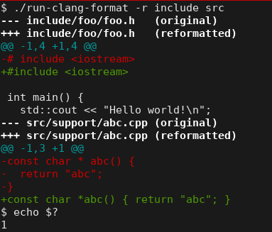

****************
run-clang-format
****************

.. contents::
   :local:

Introduction
============

A wrapper script around clang-format, suitable for linting multiple files
and to use for continuous integration.

This is an alternative API for the clang-format command line.
It runs over multiple files and directories in parallel.
A diff output is produced and a sensible exit code is returned.

How to use?
===========

Copy `run-clang-format <run-clang-format>`_ in your project,
then run it recursively on directories, or specific files::

  ./run-clang-format -r src include foo.cpp

Continuous integration
======================

Check `.travis.yml <.travis.yml>`_.

For an an example of failure in logs, click the badge (build is broken on purpose):

.. image:: https://travis-ci.org/Sarcasm/run-clang-format.svg?branch=master
    :target: https://travis-ci.org/Sarcasm/run-clang-format
